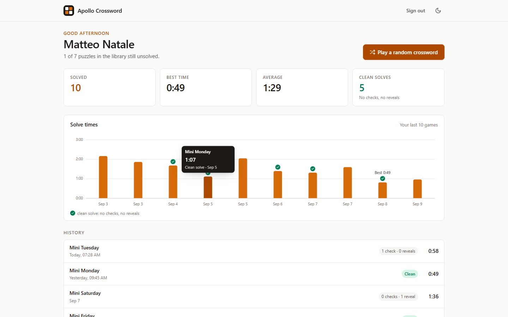
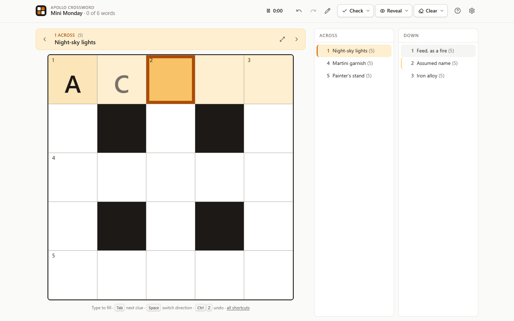
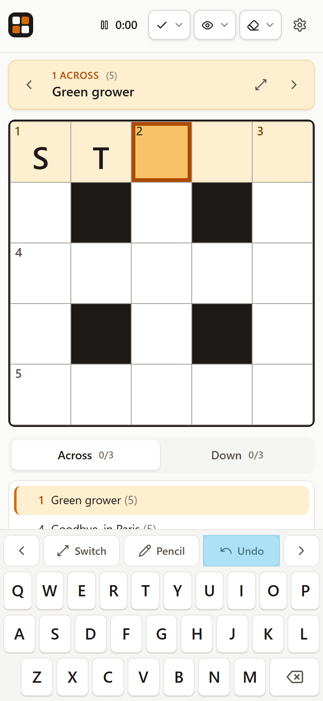

# Apollo Crossword

A crossword app built for part 2 of the Apollo assessment. It covers the
requested crossword UI and adds what a real product needs around it: player
accounts, a personal dashboard, a daily puzzle, two languages, an admin panel
and a phone experience with its own keyboard.



<p>
  
  
</p>

## Try it

| Where | How |
|---|---|
| Reviewer account | `https://<host>/login?token=matteo-natale-apollo` signs in with nothing to type |
| Same account, by form | `matteo@apollo.st` / `password` |
| Admin panel | `https://<host>/admin`, email `admin@apollo.st` / `apollo` (or `/admin?token=admin-apollo-crossword`) |

Replace `<host>` with the hosted URL sent with the submission, or with
`localhost:8787` when running locally:

```bash
npm install
npm run build   # frontend + server
npm start       # http://localhost:8787
```

Other scripts: `npm run dev` (Vite with hot reload, proxies the API to :8787),
`npm test` (43 unit tests), `npm run typecheck`.

A fresh database seeds ten puzzles, the reviewer account and three demo
players with a week of games, so nothing opens empty. Set `SEED_DEMO=false`
for a clean start.

## What it does

**Play.** Click a square or a clue and type. Letters flow through the word,
skip filled squares and jump to the next unfinished clue. Check or reveal a
letter, word or the whole grid; wrong letters get a red strike, revealed ones
are locked. Undo and redo, pencil mode for guesses, a timer that starts with
the first letter and pauses when the tab is hidden. Keyboard shortcuts for
everything (`?` shows them). Finishing shows time, checks, reveals and a
"Copy result" button with an emoji map of the grid. Progress survives a
refresh.

**Dashboard.** Opens on a greeting, today's crossword, a card to continue an
unfinished puzzle, stat tiles that count up, a chart of recent solve times
and the full puzzle list with best times. **Today's crossword** is the same
for every player, one per day and language, rotating through the library
unless the admin pins one.

**History.** Every game, grouped by month, with time and a "clean" badge for
solves without checks or reveals.

**Accounts.** No self-registration. The admin creates players; each gets a
personal sign-in link and an optional password. Sessions last 90 days and
are revoked on sign-out.

**Two languages.** English and Italian for the whole player experience,
including the game itself. Puzzles carry a language; the library ships with
the assessment crossword, six English minis and three Italian minis.

**Settings.** Name, email, password (behind an eye toggle), language, light
or dark theme.

**Admin panel** (`/admin`). Sidebar with Dashboard (totals, games per day,
today's puzzles, recent games, top solvers), Players (create, copy link, set
password, rotate link, remove), Puzzles (paste or upload JSON, choose
language, hide, delete, pin as today's) and Games (filterable list). Uploads
are validated by the same parser the game uses, so errors are exact:
"4 down runs off the grid".

**Phones.** Clue bar under the header, clue lists as tabs, and a custom
keyboard under the grid with the keys a phone lacks: switch direction,
pencil, undo, previous and next clue. The system keyboard never covers the
grid.

## Design decisions

- **One accent hue for "where you are".** The selected square and current
  word are two steps of the same amber. Green means correct, red means
  wrong, and neither is used for anything else. The palette follows
  Apollo's own (amber on stone) with a full dark set, all checked against
  WCAG AA.
- **Never spoil the puzzle.** Nothing is flagged unless you ask. Auto-check
  is a setting, off by default.
- **Plain feedback.** "1 wrong letter flagged in 9 Across." Impossible
  actions are disabled rather than hidden; destructive ones ask first.
- **A dashboard before a grid.** A product needs a place that shows
  progress, offers the next thing to do and never loses an unfinished game.
- **One parser.** Game, offline store and server validate crosswords with
  the same code.

## How it is built

```
src/
  model/       pure domain: parsing, enumeration, navigation
  state/       reducer (all game logic incl. undo and pencil), selectors, local save
  services/    Api interface, remote and offline adapters, shared stats
  game/        the game screen
  components/  Grid, ClueBar, Clues, Header, OnScreenKeyboard, SolveChart, Menu, Dialog ...
  pages/       Home, Play, History, Login, Settings, admin/
  data/        seed puzzles, accounts, demo data
  i18n/        English and Italian dictionaries, t() hook
server/        dependency-free Node HTTP server: JSON API, file store, static files
```

- **Frontend:** React 19, TypeScript (strict), Vite, CSS Modules with design
  tokens, react-router. No UI library.
- **Game logic** is a pure reducer with one-shot events for the UI. Undo is
  a snapshot stack inside it. 43 unit tests cover parsing, navigation,
  check/reveal/clear, undo, pencil, completion and the seed puzzles.
- **Storage adapter.** Components only see the `Api` interface. With the
  server present everything is shared; on a static host the app falls back
  to a localStorage adapter with the same seeds, so it works either way.
- **Translation** is a typed dictionary: Italian must provide every English
  key or the build fails. The reducer and the server emit language-neutral
  events and error codes.
- **Server:** one Node process, no dependencies, bundled with esbuild so it
  shares the client's parser and stats. Atomic JSON writes, size-capped and
  validated uploads. Player passwords are scrypt-hashed and compared in
  constant time; sessions are random server-side tokens. By product
  decision a readable copy of each password is kept so players can see it
  on their settings page, a trade-off to revisit for production.

## Deploying

Needs Node 20+, `npm run build`, `npm start`. Reads `PORT`, `DATA_DIR`
(database folder, default `./data`), `ADMIN_EMAIL`, `ADMIN_PASSWORD`,
`ADMIN_LINK_TOKEN` and `SEED_DEMO` from the environment.

- **Railway:** `railway.json` is included. Deploy from the GitHub repo, add
  the `ADMIN_*` variables, generate a domain. Mount a volume at `/data` with
  `DATA_DIR=/data` to keep the database across deploys.
- **Render:** `render.yaml` is included (free plan sleeps when idle).
- **Static hosts** serve `dist/` and get the offline mode.

## With more time

- Postgres behind the same `Api` interface, httpOnly cookie sessions, rate
  limiting on sign-in.
- Component tests with Testing Library, and the Playwright audit used during
  development checked into the repo.
- Import from `.puz` and `.ipuz`, an in-browser puzzle editor, per-puzzle
  leaderboards.
